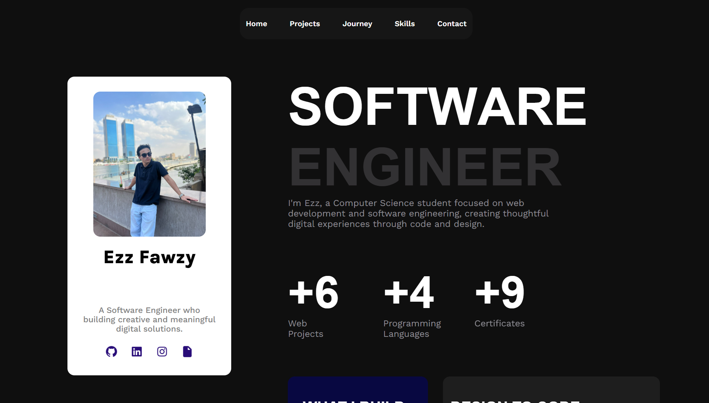

# Ezz Fawzy — Portfolio

A responsive personal portfolio website showcasing my projects, learning journey, and skills as a Computer Science student focused on web development and software engineering.

Built with plain HTML and CSS, with no frameworks and no build step.

[**Live Demo**](https://ezz08.github.io/Ezz-Portfolio/) · [GitHub](https://github.com/Ezz08) · [LinkedIn](https://www.linkedin.com/in/ezz-fawzy-6055a5380)



---

## Table of Contents

- [Features](#features)
- [Pages and Sections](#pages-and-sections)
- [Responsive Design](#responsive-design)
- [Tech Stack](#tech-stack)
- [Project Structure](#project-structure)
- [Getting Started](#getting-started)
- [Contact Form Setup](#contact-form-setup)
- [Featured Projects](#featured-projects)
- [Author](#author)
- [License](#license)

---

## Features

- **Sticky profile card** on desktop with quick links to GitHub, LinkedIn, Instagram, and a downloadable CV
- **Animated hero and section titles**: each letter reacts to hover with a small motion effect
- **Smooth scrolling** between sections from the top navigation
- **Dedicated projects page** listing all projects, alongside a three-project preview on the home page
- **Working contact form** powered by Formspree, with no backend required
- **Fully responsive** across large desktop, small desktop, tablet, and mobile
- **Dark theme** with a consistent color palette and typography

## Pages and Sections

| Page | Section | Description |
| --- | --- | --- |
| `index.html` | Home | Introduction, key stats, and what I build |
| `index.html` | Projects | Three recent projects with a link to the full list |
| `index.html` | Journey | My learning path from CS50x to web development |
| `index.html` | Skills | HTML, CSS, Bootstrap, DSA, Python, Git and GitHub |
| `index.html` | Contact | Contact form |
| `projects.html` | Projects | The complete list of projects |

## Responsive Design

The base styles in `style.css` target large desktop screens. `responsive.css` adds overrides for smaller screens.

| Device | Breakpoint | Layout |
| --- | --- | --- |
| Desktop large | 1440px and above | Sticky sidebar and two-column layout |
| Desktop small | 1080px – 1439px | Narrower sidebar, scaled typography and flexible cards |
| Tablet | 810px – 1079px | Horizontal profile card on top, full-width content below |
| Mobile | up to 809px | Single column, stacked cards, wrapped navigation |

> `responsive.css` must be linked **after** `style.css` so its overrides take effect.

## Tech Stack

- **HTML5** for semantic structure
- **CSS3** with Flexbox, Grid, transitions, keyframe animations, and media queries
- **Google Fonts**: Roboto, Work Sans, and Karla
- **Formspree** for contact form submissions
- **GitHub Pages** for hosting

## Project Structure

```
.
├── index.html
├── projects.html
├── css/
│   ├── style.css          # Base styles (large desktop)
│   └── responsive.css     # Desktop small, tablet, and mobile overrides
├── img/                   # Icons, profile photo, and project screenshots
├── assets/
│   └── Ezz_Fawzy_CV (1).pdf
└── README.md
```

## Getting Started

No installation or build step is needed.

1. **Clone the repository**

   ```bash
   git clone https://github.com/Ezz08/YOUR-REPO-NAME.git
   cd YOUR-REPO-NAME
   ```

2. **Open the site**

   Open `index.html` in your browser, or use a local server such as the VS Code **Live Server** extension.

3. **Deploy**

   Push to GitHub, then go to **Settings → Pages**, choose the `main` branch and the root folder, and save.

## Contact Form Setup

The form in `index.html` sends submissions to [Formspree](https://formspree.io). To use your own endpoint, replace the form ID in the `action` attribute:

```html
<form action="https://formspree.io/f/YOUR_FORM_ID" method="POST">
```

## Featured Projects

| Project | Description | Link |
| --- | --- | --- |
| **EcoScrap** | Responsive environmental website focused on recycling and sustainability | [Visit](https://ezz08.github.io/EcoScrap/) |
| **Hutly** | Modern real estate website focused on property discovery | [Visit](https://ezz08.github.io/Hutly/) |
| **GleamCraft** | Collaborative dental website; I built the Home and Sign In pages | [Visit](https://ezz08.github.io/GleamCraft-team-project/) |
| **Sports News** | Responsive football news website with trending stories and match coverage | [Visit](https://ezz08.github.io/Sport-News/) |
| **ZOKA** | Bold photography portfolio (best viewed at 50% browser zoom) | [Visit](https://ezz08.github.io/ZOKA/) |

## Author

**Ezz Fawzy**, Computer Science student and aspiring Software Engineer.

- GitHub: [@Ezz08](https://github.com/Ezz08)
- LinkedIn: [Ezz Fawzy](https://www.linkedin.com/in/ezz-fawzy-6055a5380)

Feel free to reach out through the contact form on the site.

## License

This project is licensed under the [MIT License](LICENSE). You are welcome to use it as inspiration, but please don't copy it as-is and present it as your own work.
